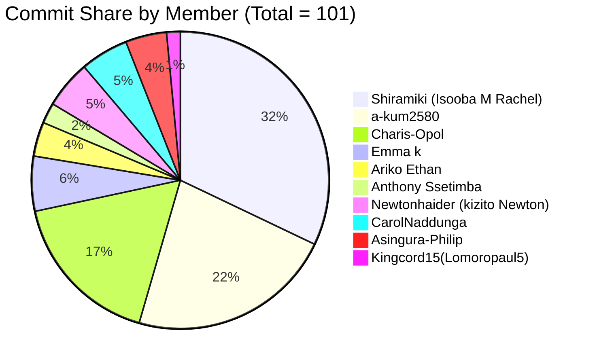
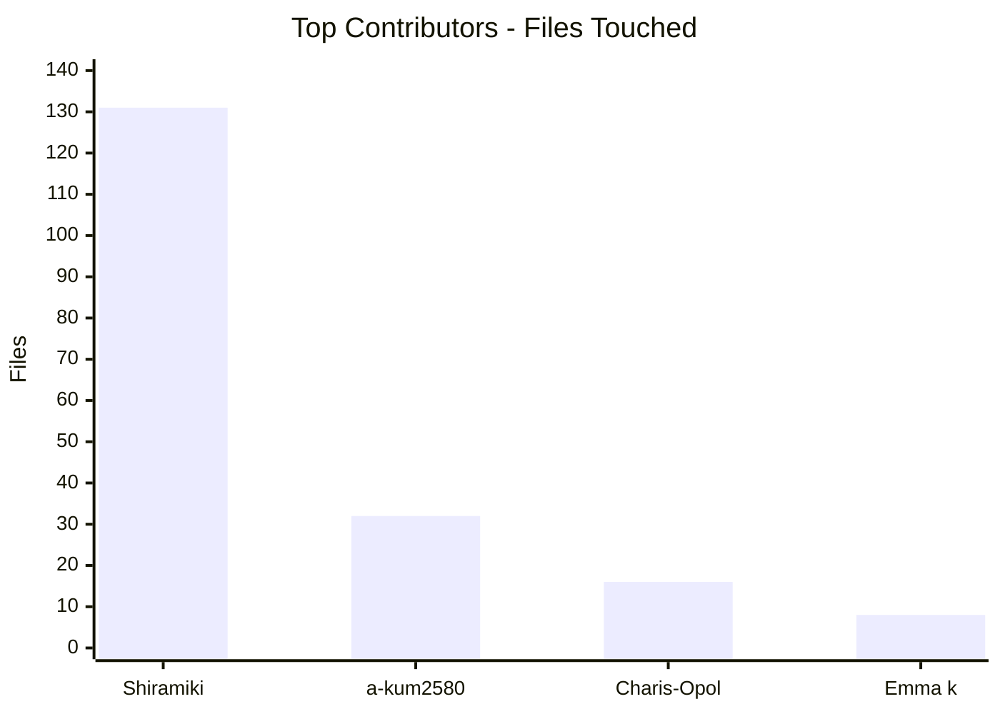
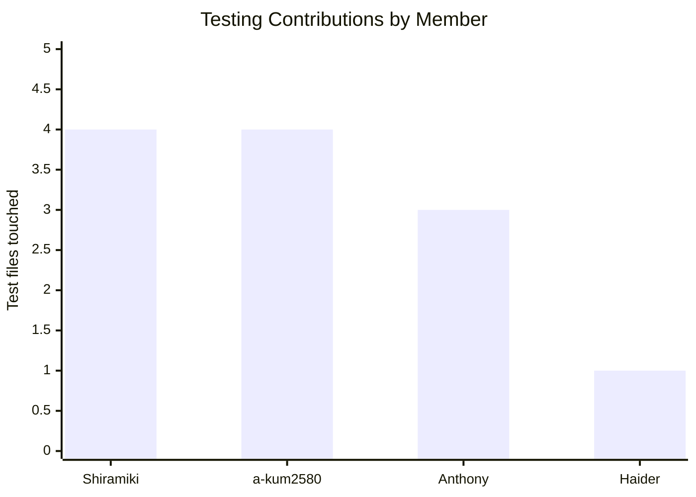

# Contributions Report

This report summarizes repository contributions based on git history.

Scope and method:
- Source: git log on this repository
- Metrics: non-merge commits, changed files, insertions, deletions, and area touched
- Snapshot date: 2026-04-16
- Note: some teammates may appear under multiple identities (for example personal email and GitHub noreply email).

## 1) Team Contribution Graphs

### Commit Share by Member (non-merge commits)

### Top Contributors by Files Touched

## 2) Summary Table (non-merge commits)

| Member | Commits | Files Touched | Insertions | Deletions |
|---|---:|---:|---:|---:|
| Shiramiki | 43 | 52 | 4496 | 1478 |
| a-kum2580 | 30 | 25 | 1155 | 682 |
| Charis-Opol | 23 | 23 | 8855 | 3394 |
| Emma k | 8 | 8 | 32 | 46 |
| Ariko Ethan | 5 | 5 | 249 | 348 |
| Anthony Ssetimba | 3 | 3 | 414 | 0 |
| Newtonhaider | 2 | 2 | 43 | 2 |
| lomoro paul | 2 | 2 | 38 | 21 |
| CarolNaddunga | 7 | 5 | 51 | 41 |
|Asingura-Philip | 6| 29 | 8627| 2668|

## 3) Detailed Contributions by Member (Files + Responsibilities)

### Shiramiki
- Main areas: backend (89), frontend (36), docs (12).
- Core responsibilities: recommendation engine evolution, dashboard analytics, search and mood UX flows, API robustness, search-page and movie-page maintenance plus documentation cleanup, backend optimisation.
- High-impact files changed:
  - backend/recommendations/views.py (14 touches)
  - backend/recommendations/tests.py (12)
  - backend/movies/views.py (10)
  - frontend/src/app/dashboard/page.tsx (8)
  - backend/recommendations/services/engine.py (5)
  - frontend/src/app/movie/[id]/page.tsx (5)
  - frontend/src/app/search/page.tsx (5)
  - backend/movies/services/discovery_service.py (5)
  - backend/movies/services/tmdb_service.py (5)
  - README.md (2 touches)
  - frontend/src/app/search/page.tsx
  - frontend/src/app/movie/[id]/page.tsx
  - frontend/src/lib/api.ts
  - frontend/src/types/movie.ts

### a-kum2580
- Main areas: backend (25), frontend (4), docs (3),  backend setup (3), repo governance (1).
- Core responsibilities: backend reliability, user validation paths, serializer/API hardening, technical report updates.
- High-impact files changed:
  - backend/users/serializers.py (4 touches)
  - backend/users/tests.py (4)
  - backend/movies/tests.py (2)
  - backend/movies/test_views.py (2)
  - backend/movies/test_serializers.py (2)
  - backend/cinequest/settings.py (2)
  - BACKEND_TECHNICAL_REPORT.md (2)
- Files changed:
  - backend/cinequest/asgi.py
  - backend/cinequest/settings.py
  - backend/cinequest/urls.py
  - .github/CODEOWNERS

### Charis-Opol
- Main areas: frontend (16).
- Core responsibilities: frontend refactoring and DRY improvements.
- High-impact files changed:
  - frontend/src/app/page.tsx (4 touches)
  - frontend/src/app/compare/page.tsx (4)
  - frontend/src/components/PersonalizedSection.tsx (3)
  - frontend/src/components/HeroSection.tsx (3)

### Emma k
- Main areas: backend (8).
- Core responsibilities: TMDB service and serializer/view optimizations.
- High-impact files changed:
  - backend/movies/views.py (3 touches)
  - backend/movies/services/tmdb_service.py (3)
  - backend/movies/serializers.py (2)

### Ariko Ethan
- Main areas: frontend (5).
- Core responsibilities: movie/search UI data-shaping and safer API result handling.
- High-impact files changed:
  - frontend/src/lib/api.ts (2 touches)
  - frontend/src/types/movie.ts
  - frontend/src/app/movie/[id]/page.tsx
  - frontend/src/app/search/page.tsx

### Anthony Ssetimba
- Main areas: backend testing (3).
- Core responsibilities: expanding app-level test coverage.
- Files changed:
  - backend/recommendations/tests.py
  - backend/movies/tests.py
  - backend/users/tests.py

### CarolNaddunga
- Main areas: backend (4), docs (1).
- Core responsibilities: recommendations service and settings wiring.
- Files changed:
  - backend/recommendations/views.py
  - backend/recommendations/services/engine.py
  - backend/cinequest/settings.py
  - backend/.env.example
  - README.md

### Haider0012831
- Main areas: frontend testing/build config (2).
- Files changed:
  - frontend/src/app/search/Navbar.test.tsx
  - frontend/src/app/globals.css

### lomoro paul
- Main areas: frontend search/mood flow (2).
- Files changed:
  - frontend/src/app/search/page.tsx
  - frontend/src/app/mood/page.tsx

## 4) Who Tested What

This section is based on test-file modifications and test-focused commit subjects.

### Testing Contribution Graph (test files touched)

| Member | Evidence of Testing Contribution | Test Files |
|---|---|---|
| Shiramiki | Expanded recommendation and movie regression coverage; added focused validation script | backend/recommendations/tests.py, backend/movies/tests.py, backend/users/tests.py, backend/test_weights.py |
| a-kum2580 | Added and updated multiple backend test suites and dedicated movie test modules | backend/users/tests.py, backend/movies/tests.py, backend/movies/test_views.py, backend/movies/test_serializers.py, backend/recommendations/tests.py |
| Anthony Ssetimba | Added app-specific tests for users, movies, and recommendations | backend/users/tests.py, backend/movies/tests.py, backend/recommendations/tests.py |
| Haider0012831 | Added frontend component test | frontend/src/app/search/Navbar.test.tsx |

No direct test-file edits were found for some members; their contributions were primarily implementation/refactor/configuration work.

